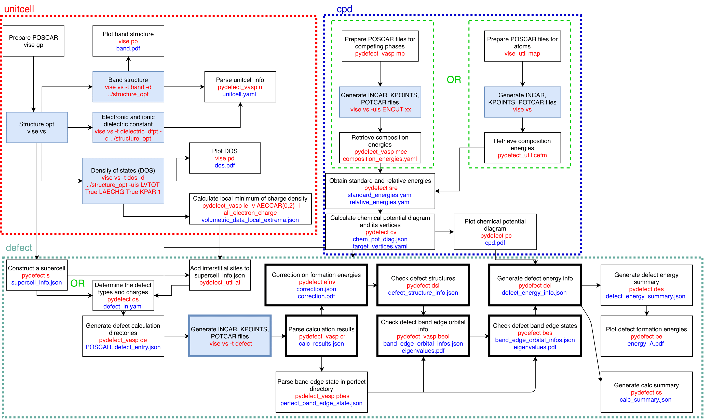

.. pydefect documentation master file

Welcome to pydefect documentation!
==================================

pydefect is a Python package for point-defect calculations in non-metallic solids.

Features
--------

- **Automated workflow** for defect formation energy calculations
- **Supercell generation** with symmetry analysis
- **Electrostatic corrections** (EFNV, GKFO)
- **Chemical potential diagrams** for multi-component systems
- **Integration with VASP** and Materials Project

Quick Links
-----------

- :doc:`getting_started/quick_start` - Get started in 5 minutes
- :doc:`user_guide/index` - Step-by-step tutorial
- :doc:`api/index` - Python API reference

Contents
--------

.. toctree::
   :maxdepth: 2
   :caption: Getting Started

   getting_started/index

.. toctree::
   :maxdepth: 2
   :caption: User Guide

   user_guide/index
   tutorial

.. toctree::
   :maxdepth: 2
   :caption: Explanation

   explanation/index

.. toctree::
   :maxdepth: 2
   :caption: API Reference

   api/index

.. toctree::
   :maxdepth: 2
   :caption: Developer

   developer/index

.. toctree::
   :maxdepth: 1
   :caption: Other

   first_principles_calc
   change_log

Indices and tables
==================

* :ref:`genindex`
* :ref:`modindex`
* :ref:`search`
